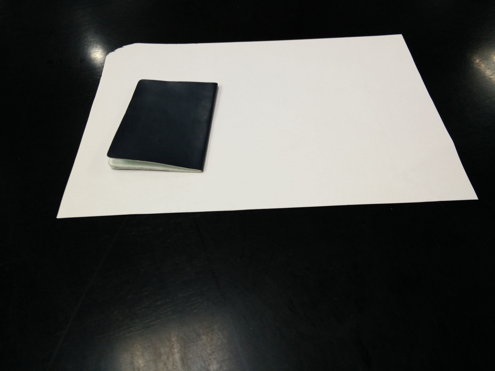
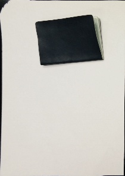

#imageProcess 项目说明

###准备
在运行之前，先将要测试的文件放在 image 文件夹下	[已经放了一些图片在里面]，此时文件目录如下：

	.
	├── CMakeLists.txt
	├── data
	│   ├── 17.jpg
	│   ├── 18.jpg
	│   ├── 19.jpg
	│   ├── 20.jpg
	│   ├── 21.jpg
	│   ├── 22.jpg
	│   ├── 23.jpg
	│   └── 24.jpg
	├── image
	│   ├── // 要处理的图片
	├── readme.MD
	├── result
	├── run.sh
	└── src
	    └── imageProcess.cpp

###运行
运行程序(需要在 bash 环境下):
	
	$ bash run.sh
	
如果在 windows 下面，在目录下面运行如下命令：
	
	$ cmake .
	$ make
	$ src/imageProcess [path to image list]
	
	eg:
	src/imageProcess image/a.jpg image/b.jpg image/c.jpg
	
在 image 下面的图片中，有两张的效果并不是很好，可能原因是在查找边缘的时候由于光照的原因边缘处理不好。

###个人测试
data 文件夹下是我的个人测试图像，要运行这份图像，要进行测试的话，运行如下指令：

	$ bash run.sh
	
测试结果如下所示：

原图：

结果：

	
###结果
运行完毕后从 result 文件夹查看结果，结果图片的文件名为：原名+dst，如：

	image1.jpg --> image1dst.jpg
	
###Author

	E-mail：xiezhw3@163.com
	github: www.github/xiezhw3